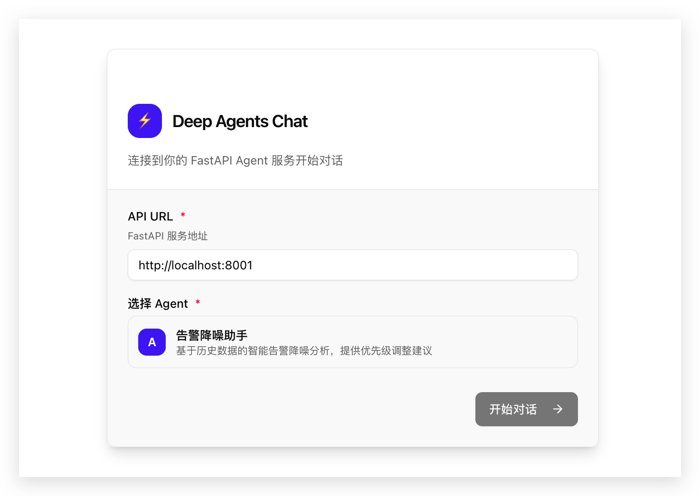

# 🤖 多 Agent 智能服务平台

基于 LangChain Deepagents 构建的**多 Agent Web 服务框架**。

参考: [Deepagents Quickstarts](https://github.com/langchain-ai/deepagents)

## ✨ 特性

- 🎯 **多 Agent 架构**: 通过 `/agents/{type}/` 路由访问不同 Agent
- 🧩 **专业技能系统**: 采用 `SKILL.md` 格式定义深度技能，按需动态加载
- 🔌 **MCP 服务注册**: 支持多种 MCP 服务，按 Agent 类型分配
- 🇨🇳 **中文友好**: 针对中文环境优化，提供自然的沟通体验
- 🌊 **全异步流式响应**: 支持 SSE (Server-Sent Events) 实时输出

## 🤖 可用 Agent

| Agent | 路由 | 描述 |
|-------|------|------|
| 🔔 **Alert Noise Reduction** | `/agents/alert_noise_reduction/` | 告警降噪：历史相似告警搜索、Rerank 优化排序 |

## 📁 项目结构

```
langchain_skills/
├── src/
│   ├── core/                   # 核心框架层
│   │   ├── base_agent.py       # Agent 基类和工厂
│   │   ├── mcp_registry.py     # MCP 服务注册
│   │   ├── events.py           # SSE 事件构建器
│   │   └── text_buffer.py      # 流式输出文本缓冲器
│   │
│   ├── agents/                 # Agent 实现（每个 Agent 自包含）
│   │   └── alert_noise_reduction/  # 告警降噪 Agent
│   │       ├── agent.py
│   │       ├── config.py
│   │       ├── tools.py        # Milvus 向量搜索 + Rerank
│   │       └── skills_data/
│   │
│   ├── api.py                  # FastAPI 入口（多 Agent 路由）
│   └── config.py               # 配置管理
│
├── docs/                       # 文档
│   └── agent_development_guide.md   # Agent 开发指南
│
├── pyproject.toml              # 项目配置与依赖
├── .env                        # 环境变量
└── README.md
```

## 🚀 快速开始

### 1. 安装依赖

确保已安装 [uv](https://github.com/astral-sh/uv):

```bash
uv sync
```

### 2. 配置环境变量

复制 `.env_example` 为 `.env` 并填写：

```bash
ALIYUN_API_KEY=your_api_key

# Milvus 向量数据库
MILVUS_ADDRESS=localhost:19530
MILVUS_DATABASE=your_database
MILVUS_USERNAME=your_username
MILVUS_PASSWORD=your_password

# Embedding 模型
EMBEDDING_API_KEY=your_embedding_key
EMBEDDING_MODEL=text-embedding-v4

# Rerank 模型
RERANK_API_KEY=your_rerank_key
RERANK_MODEL=gte-rerank-v2
```

### 3. 启动服务

```bash
uv run uvicorn src.api:app --host 0.0.0.0 --port 8001 --reload
```

访问 http://localhost:8001/docs 查看 API 文档。

## 📡 API 端点

| 端点 | 方法 | 描述 |
|------|------|------|
| `/agents` | GET | 获取所有可用 Agent 列表 |
| `/agents/{type}/chat` | POST | 非流式聊天 |
| `/agents/{type}/chat/stream` | POST | 流式聊天 (SSE) |
| `/agents/{type}/skills` | GET | 获取 Agent 技能列表 |
| `/health` | GET | 健康检查 |


### 4. 前端demo

```bash
cd my-chat-ui
pnpm install
pnpm dev
```

访问：http://localhost:3000
 



### 使用示例

```bash
# 获取 Agent 列表
curl http://localhost:8001/agents | jq

# 与告警降噪 Agent 聊天
curl -X POST http://localhost:8001/agents/alert_noise_reduction/chat \
  -H "Content-Type: application/json" \
  -d '{"message": "分析这个告警: CPU使用率超过90%"}' | jq

# 获取 Agent 技能
curl http://localhost:8001/agents/alert_noise_reduction/skills | jq
```


## 🛠️ Agent 技能与工具

### Alert Noise Reduction Agent

**技能** (`skills_data/`)：

| 技能名称 | 说明 |
|---------|------|
| `noise-reduction-analysis` | 告警降噪分析：噪音判定、SOP推荐 |
| `markdown-format` | Markdown 输出规范 |

**工具** (`tools.py`)：`search_similar_alerts` (Milvus 向量搜索 + DashScope Rerank)

## 🔧 扩展 Agent

添加新 Agent 只需 5 步：

1. 创建 `src/agents/{new_agent}/` 目录
2. 实现 `config.py` 和 `agent.py`
3. 添加技能到 `skills_data/`
4. 添加专用工具到 `tools.py`（可选）
5. 在 `src/agents/__init__.py` 中导入

详细指南请查看 [Agent 开发文档](./.claude/skills/docs/agent-development-guide.md)。

## 🔍 核心原理

本项目基于 `deepagents` 框架：

1. **BaseAgent + 注册表**: 统一的 Agent 基类和工厂模式
2. **Agent 私有工具**: 每个 Agent 在自己目录下的 `tools.py` 中定义专用工具
3. **MCPRegistry**: 多 MCP 服务注册和按需加载
4. **FilesystemBackend**: 提供底层文件访问支持
5. **LangGraph**: `deepagents` 内部基于 LangGraph 实现 ReAct 循环

## 📚 文档/SKILLS

- [Agent 开发指南](./.claude/skills/docs/agent-development-guide.md) - 如何添加新 Agent
- [Agent 运行流程](./docs/agent_workflow.md) - Agent 运行流程参考文档
- 支持直接在支持SKILLS的AI IDE中进行开发（如Claude Code，Cursor等）

