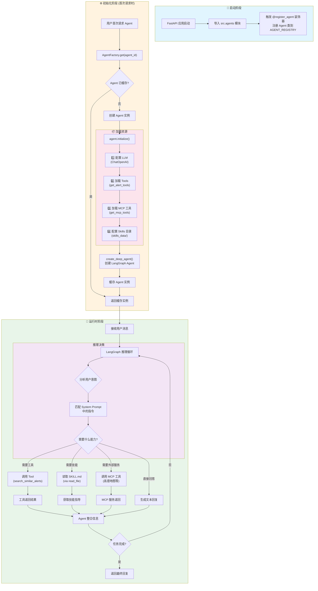
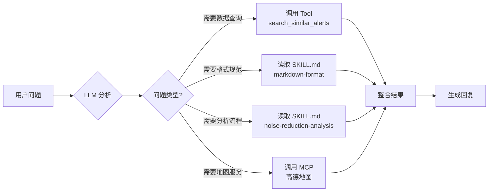
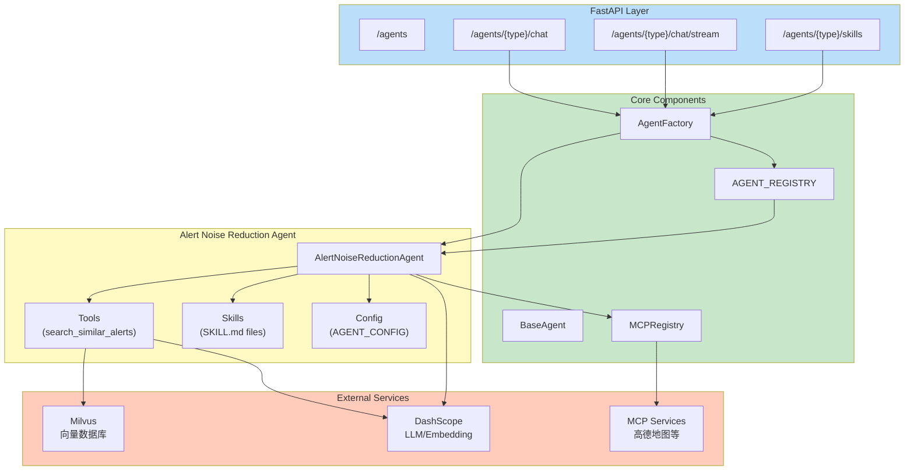

# DeepAgent 工作流程分析

## 概述

本项目基于 **LangChain + DeepAgents** 构建多 Agent 智能服务平台。Agent 在启动时会按顺序加载 **Tools、MCP 服务、Skills**，然后在运行时根据用户问题和 System Prompt 智能选择合适的工具/技能来协作完成任务。

---

## 核心工作流程图



---

## 详细流程说明

### 1️⃣ 启动阶段 (Application Startup)

当 FastAPI 应用启动时：

1. **触发 Agent 注册**：导入 `src.agents` 模块时，`@register_agent("alert_noise_reduction")` 装饰器将 Agent 类注册到全局 `AGENT_REGISTRY` 字典中

2. **初始化配置**：加载环境变量和配置（LLM、Milvus、Embedding 等）

```python
# src/agents/__init__.py
from src.agents.alert_noise_reduction import AlertNoiseReductionAgent
# 导入时触发 @register_agent 装饰器，完成注册
```

> [!NOTE]
> 此阶段只是注册 Agent 类，**不会**实际创建实例或加载任何资源。

---

### 2️⃣ 初始化阶段 (First Request Initialization)

当用户首次请求某个 Agent 时：

1. **获取实例**：`AgentFactory.get(agent_id)` 检查缓存，如无则创建新实例
2. **调用 initialize()**：执行完整的初始化流程

#### 资源加载顺序

| 步骤 | 操作 | 代码位置 |
|------|------|----------|
| 1 | 配置 LLM (ChatOpenAI) | `agent.py:43-48` |
| 2 | 加载本地 Tools | `tools.py` → `get_alert_tools()` |
| 3 | 加载 MCP 服务工具 | `mcp_registry.py` → `get_mcp_tools()` |
| 4 | 配置 Skills 目录 | `skills_data/` 目录路径 |
| 5 | 创建 DeepAgent | `create_deep_agent(tools, skills, ...)` |

```python
# AlertNoiseReductionAgent.initialize()
async def initialize(self) -> None:
    # 1. 配置技能目录
    self._skills_dir = os.path.join(os.path.dirname(__file__), "skills_data")
    
    # 2. 配置 LLM
    llm = ChatOpenAI(model=..., api_key=..., base_url=...)
    
    # 3. 获取工具 (Tools + MCP)
    tools = await self._get_tools()
    
    # 4. 创建 deep agent (Skills 在这里传入)
    self._graph = create_deep_agent(
        model=llm,
        tools=tools,
        skills=[self._skills_dir],  # ← Skills 目录
        ...
    )
```

> [!IMPORTANT]
> **Skills 的加载机制**：Skills 目录被传递给 `create_deep_agent()`，DeepAgents 框架会自动扫描目录下的 `SKILL.md` 文件。Agent 在运行时通过 `read_file` 工具读取这些文件来获取技能指导。

---

### 3️⃣ 运行时阶段 (Runtime Reasoning)

当 Agent 接收到用户消息后：

1. **LangGraph 推理循环**：Agent 进入推理-行动循环
2. **意图识别**：分析用户问题，结合 System Prompt 确定需要的能力
3. **动态选择**：根据需要调用 Tools、读取 Skills 或请求 MCP 服务
4. **迭代执行**：循环执行直到任务完成

#### 工具/技能选择逻辑



---

## Skills 元数据加载验证

### Skills 是否成功加载？

**是的，Skills 元数据已成功加载。** 通过以下方式验证：

1. **目录结构**：`skills_data/` 下存在有效的 `SKILL.md` 文件

```
src/agents/alert_noise_reduction/skills_data/
├── markdown-format/
│   └── SKILL.md          ✅ 包含 YAML frontmatter
└── noise-reduction-analysis/
    └── SKILL.md          ✅ 包含 YAML frontmatter
```

2. **元数据解析**：`list_skills()` 方法可正确解析 SKILL.md 的 YAML frontmatter

```python
def list_skills(self) -> List[Dict[str, str]]:
    """列出可用技能"""
    skills = []
    for entry in os.listdir(self._skills_dir):
        skill_md = os.path.join(entry_path, "SKILL.md")
        if os.path.exists(skill_md):
            description = self._parse_skill_description(skill_md)
            skills.append({"name": entry, "description": description})
    return skills
```

3. **API 验证**：可通过 `/agents/alert_noise_reduction/skills` 端点获取技能列表

```bash
curl http://localhost:8000/agents/alert_noise_reduction/skills
```

返回示例：
```json
{
  "agent_id": "alert_noise_reduction",
  "skills": [
    {
      "name": "markdown-format",
      "description": "Markdown 输出规范：确保输出格式正确渲染。"
    },
    {
      "name": "noise-reduction-analysis", 
      "description": "告警降噪分析：基于历史数据判定噪音等级，输出结构化报告。"
    }
  ],
  "count": 2
}
```

4. **运行时使用**：当 Agent 读取 `SKILL.md` 时，会发出 `skill:loaded` SSE 事件

---

## 组件交互关系图



---

## 关键代码文件

| 文件 | 职责 |
|------|------|
| [api.py](file:///Users/huntershen/devops/aigc/langchain_skills/src/api.py) | FastAPI 入口，路由定义 |
| [base_agent.py](file:///Users/huntershen/devops/aigc/langchain_skills/src/core/base_agent.py) | Agent 基类、注册器、工厂 |
| [agent.py](file:///Users/huntershen/devops/aigc/langchain_skills/src/agents/alert_noise_reduction/agent.py) | Alert Noise Reduction Agent 实现 |
| [tools.py](file:///Users/huntershen/devops/aigc/langchain_skills/src/agents/alert_noise_reduction/tools.py) | Milvus 向量搜索工具 |
| [mcp_registry.py](file:///Users/huntershen/devops/aigc/langchain_skills/src/core/mcp_registry.py) | MCP 服务管理 |
| [events.py](file:///Users/huntershen/devops/aigc/langchain_skills/src/core/events.py) | SSE 事件构建器 |

---

## 总结

### 运行顺序

1. **启动时**：Agent 类注册到全局注册表（不加载资源）
2. **首次请求时**：加载 LLM → Tools → MCP → Skills → 创建 LangGraph Agent
3. **运行时**：LLM 推理循环中动态选择 Tools 或读取 Skills

### Skills vs Tools

| 特性 | Tools | Skills |
|------|-------|--------|
| 定义方式 | Python 函数 + `@tool` 装饰器 | SKILL.md 文件 |
| 加载时机 | Agent 初始化时导入 | 运行时按需读取 |
| 作用 | 执行具体操作（查询、调用 API） | 提供指导规范（格式、流程） |
| 元数据 | 函数 docstring | YAML frontmatter |

### DeepAgents Skills 机制

DeepAgents 框架通过以下方式使用 Skills：

1. 将 `skills` 目录路径传递给 `create_deep_agent()`
2. 框架自动注册 `read_file` 等文件操作工具
3. Agent 运行时可以读取 `SKILL.md` 获取执行指导
4. Skills 本质是 **"知识增强"**，不是可执行代码

> [!TIP]
> 可以通过创建新的 `SKILL.md` 文件来扩展 Agent 的能力，无需修改代码。
